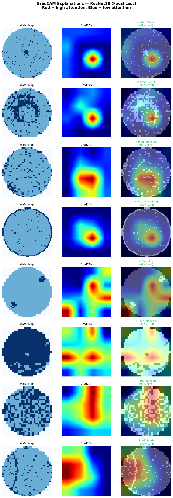
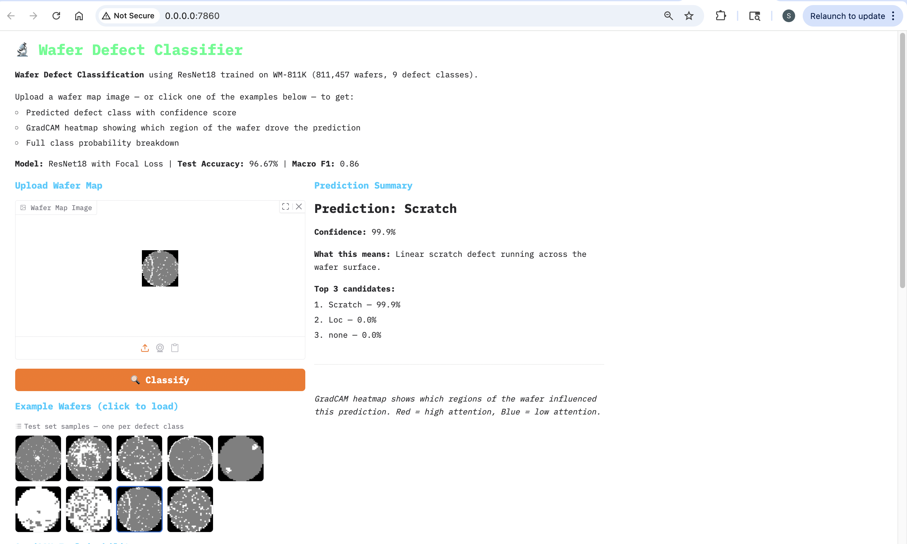
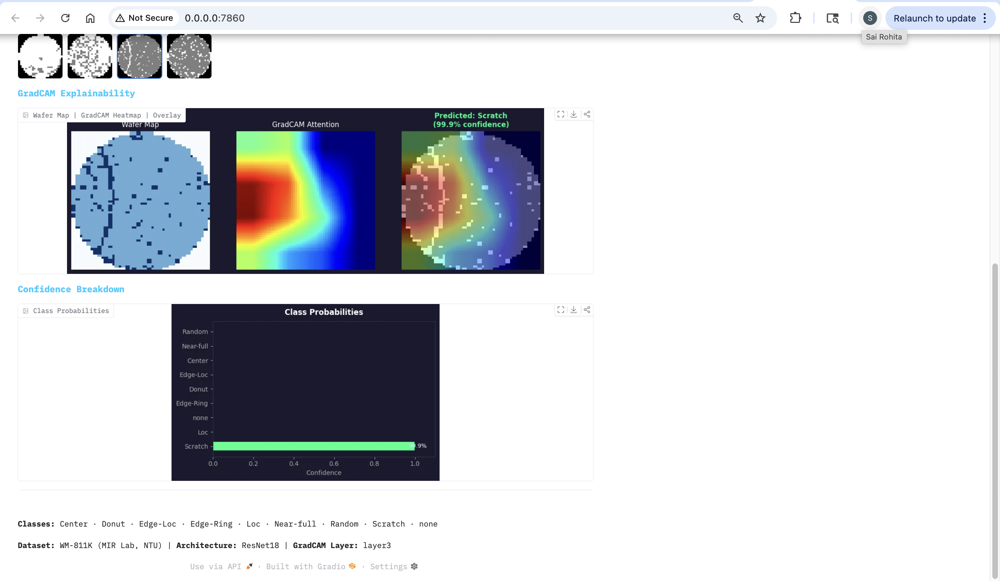

# 🔬 Wafer Defect Classification — End-to-End Deep Learning System

> Automatically classify semiconductor wafer defects using deep learning — from raw wafer maps to a live interactive web app.

**96.67% test accuracy · 0.86 macro F1 · GradCAM explainability · Gradio web app**


*GradCAM attention heatmaps showing where the model looks for each defect class. Red = high attention, Blue = low attention.*

---

## 🌐 Live Demo


*Upload a wafer map → get predicted defect class + GradCAM heatmap + confidence breakdown instantly*


*GradCAM overlay showing model attention on a Scratch defect (99.9% confidence)*

---

## 📋 Table of Contents

1. [What This Project Does](#1-what-this-project-does)
2. [The Real-World Problem](#2-the-real-world-problem)
3. [Dataset](#3-dataset)
4. [How To Run This Project](#4-how-to-run-this-project)
5. [Project Structure](#5-project-structure)
6. [Step 1 — Exploratory Data Analysis](#6-step-1--exploratory-data-analysis)
7. [Step 2 — Preprocessing](#7-step-2--preprocessing)
8. [Step 3 — Baseline CNN (ResNet18)](#8-step-3--baseline-cnn-resnet18)
9. [Step 4 — Focal Loss (Best Model)](#9-step-4--focal-loss-best-model)
10. [Step 5 — Vision Transformer Comparison](#10-step-5--vision-transformer-comparison)
11. [Step 6 — GradCAM Explainability](#11-step-6--gradcam-explainability)
12. [Step 7 — Gradio Demo App](#12-step-7--gradio-demo-app)
13. [Full Results](#13-full-results)
14. [Key Findings](#14-key-findings)
15. [Model Card](#15-model-card)
16. [Future Work](#16-future-work)
17. [Acknowledgements](#17-acknowledgements)

---

## 1. What This Project Does

This project builds a complete machine learning system that looks at a **wafer map** (a 2D image of a semiconductor wafer showing which chips are defective) and automatically classifies what kind of defect it has — or whether it has no defect at all.

It covers the **entire ML engineering lifecycle**:

| Stage | What Happens |
|---|---|
| EDA | Understand the dataset, find the class imbalance problem |
| Preprocessing | Resize, normalize, split, compute class weights |
| Baseline Model | Train ResNet18, establish benchmark |
| Imbalance Fix | Apply focal loss to improve rare class performance |
| Architecture Comparison | Test Vision Transformer, understand why CNN wins |
| Explainability | Use GradCAM to visualize what the model looks at |
| Deployment | Build a Gradio web app for live predictions |

---

## 2. The Real-World Problem

### What is a Wafer Map?

In semiconductor manufacturing, silicon wafers are processed into hundreds of chips (called dies). After manufacturing, each die is tested — it either works or it doesn't. A **wafer map** is a 2D grid where:
- `0` = no die at this position (edge of circular wafer)
- `1` = working die ✅
- `2` = defective die ❌

Here's what different defect patterns look like:

| Class | Visual Pattern | What It Means |
|---|---|---|
| **Center** | Dark cluster in the middle | Contamination at the center of the process tool |
| **Edge-Ring** | Dark ring around the boundary | Non-uniform process at the wafer edge |
| **Scratch** | Thin diagonal line | Physical contact from a robot arm |
| **Loc** | Small dark blob anywhere | Localized contamination |
| **Edge-Loc** | Small dark blob at the edge | Localized contamination near the edge |
| **Donut** | Ring of defects with clean center | Process issue creating ring pattern |
| **Near-full** | Almost entire wafer dark | Catastrophic process failure |
| **Random** | Defects scattered everywhere | Random contamination, no single cause |
| **none** | Clean wafer | No defect pattern detected |

### Why Automate This?

- A factory processes **hundreds of thousands of wafers** — manual inspection doesn't scale
- Identifying the defect type lets engineers find and fix the **root cause faster**
- Faster root cause analysis = fewer defective products = higher yield = more profit

### Why Is This Hard?

The dataset has two major challenges:

**Challenge 1 — Extreme class imbalance:**
```
none (no defect) = 85.2% of all labeled wafers
Near-full        = 0.1%  ← only 149 samples total
```
A model that always predicts "none" gets 85% accuracy while being completely useless.

**Challenge 2 — Variable wafer map sizes:**
Wafer maps range from 18×13 pixels to 212×204 pixels. Neural networks need fixed-size input — we need to resize everything carefully.

---

## 3. Dataset

**WM-811K (Large-Scale Wafer Map Dataset)**

| Property | Value |
|---|---|
| Source | MIR Lab, Prof. Roger Jang, National Taiwan University |
| Total wafers | 811,457 |
| Labeled wafers | 172,950 (21.3%) |
| Format | Pickle file (LSWMD.pkl, 214 MB) |
| Download | http://mirlab.org/dataset/public/ |

### Class Distribution

| Class | Training Samples | % of Labeled Data |
|---|---|---|
| none | 147,431 | 85.2% |
| Edge-Ring | 9,680 | 5.6% |
| Edge-Loc | 5,189 | 3.0% |
| Center | 4,294 | 2.5% |
| Loc | 3,593 | 2.1% |
| Scratch | 1,193 | 0.7% |
| Random | 866 | 0.5% |
| Donut | 555 | 0.3% |
| Near-full | 149 | 0.1% |

> **⚠️ The dataset file (`LSWMD.pkl`) is 214MB and not included in this repo.**
> Download it from the link above and place it at `data/raw/LSWMD.pkl` before running any notebooks.

---

## 4. How To Run This Project

### Step 1 — Clone the repository

```bash
git clone https://github.com/SaiRohitaBhaskaruni01/wafer-defect-classification.git
cd wafer-defect-classification
```

### Step 2 — Create and activate the conda environment

```bash
conda create -n wafer-ml python=3.11
conda activate wafer-ml
```

### Step 3 — Install dependencies

```bash
pip install -r requirements.txt
```

### Step 4 — Download the dataset

Download `LSWMD.pkl` from http://mirlab.org/dataset/public/ and place it at:
```
data/raw/LSWMD.pkl
```

### Step 5 — Run the notebooks in order

```bash
# Open Jupyter
jupyter notebook

# Run in this order:
notebooks/01_eda.ipynb
notebooks/02_preprocessing.ipynb
notebooks/03_baseline_cnn.ipynb
notebooks/04_focal_loss.ipynb
notebooks/05_vit.ipynb
notebooks/06_explainability.ipynb
```

### Step 6 — Launch the Gradio demo app

```bash
conda activate wafer-ml
python app.py
# Open http://localhost:7860 in your browser
```

### Requirements

```
torch>=2.0.0
torchvision>=0.15.0
numpy>=1.24.0
pandas>=2.0.0
scikit-learn>=1.3.0
matplotlib>=3.7.0
opencv-python>=4.8.0
gradio>=4.0.0
mlflow>=2.8.0
Pillow>=10.0.0
timm>=0.9.0
```

**Hardware:** All experiments run on Apple M2 (MPS backend). The code auto-detects your device — CUDA GPU and CPU are also fully supported.

---

## 5. Project Structure

```
wafer-defect-classification/
│
├── 📓 notebooks/
│   ├── 01_eda.ipynb                 # Explore the data, understand class imbalance
│   ├── 02_preprocessing.ipynb       # Resize, normalize, split, compute weights
│   ├── 03_baseline_cnn.ipynb        # ResNet18 baseline → 95.26% accuracy
│   ├── 04_focal_loss.ipynb          # Focal loss → 96.67% accuracy (best model)
│   ├── 05_vit.ipynb                 # Vision Transformer → 96.20%, F1 0.79
│   └── 06_explainability.ipynb      # GradCAM heatmaps + failure analysis
│
├── 📁 data/
│   ├── raw/
│   │   └── LSWMD.pkl                # ← Download separately (214 MB)
│   └── processed/
│       ├── train.pkl                # 120,908 training samples
│       ├── val.pkl                  # 25,908 validation samples
│       ├── test.pkl                 # 25,908 test samples (held out)
│       ├── label_encoder.pkl        # Class name ↔ integer mapping
│       ├── class_weights.pt         # Per-class loss weights
│       ├── best_resnet18.pt         # Baseline model weights
│       ├── best_focal.pt            # Best model weights ← used in app
│       ├── best_vit.pt              # ViT model weights
│       ├── gradcam_all_classes.png  # GradCAM heatmap grid
│       ├── gradcam_misclassified.png
│       ├── confusion_matrix_*.png   # One per experiment
│       └── *_training_curves.png    # Loss/accuracy curves
│
├── 🖼️ assets/
│   ├── demo_screenshot.png          # Gradio app screenshot
│   └── demo_gradcam.png             # GradCAM output screenshot
│
├── 🚀 app.py                        # Gradio web application
├── requirements.txt
└── README.md
```

---

## 6. Step 1 — Exploratory Data Analysis

**📓 Notebook:** `notebooks/01_eda.ipynb`

### Why Do EDA First?

EDA is the most important step that beginners skip. Every decision made in preprocessing, model design, and training strategy comes from what you discover here. Skipping EDA means you're making arbitrary choices that may actively hurt your model.

### What We Did and What We Found

#### Loading the data

```python
import pandas as pd
df = pd.read_pickle('data/raw/LSWMD.pkl')
print(df.shape)  # (811457, 6)
```

The dataset has 811,457 rows. But looking at `failureType`:
```python
df['failureType'].isna().sum()  # 638,507 unlabeled!
```

Only 172,950 samples are labeled. We drop the rest.

#### Class distribution — the imbalance problem

```
none        147,431   85.2%  ← dominates everything
Edge-Ring     9,680    5.6%
Edge-Loc      5,189    3.0%
Center        4,294    2.5%
Loc           3,593    2.1%
Scratch       1,193    0.7%
Random          866    0.5%
Donut           555    0.3%
Near-full       149    0.1%  ← critically rare
```

**Key insight:** If we train a model with standard cross-entropy loss on this data, it will learn to always predict "none" to minimize loss. We need a strategy to force it to learn the rare classes.

#### Visual inspection of each class

Plotting sample wafers for each class reveals their visual signatures. Most importantly, we notice that **Scratch** is fundamentally different — it's a thin line, not a blob or region. This matters for architecture selection later.

#### Size distribution

Wafer maps vary hugely in size: smallest is 18×13, largest is 212×204. We need to resize to a fixed dimension. We chose **64×64** — large enough to capture most patterns, small enough for fast training. However, this means a scratch line that is 2-3 pixels wide at original resolution could become just 1 pixel wide at 64×64 — barely visible. This is flagged here and confirmed as a problem later in GradCAM analysis.

### Outputs

| Output | Saved To |
|---|---|
| Class distribution bar chart | `data/processed/sample_per_class.png` |
| Wafer size histogram | `data/processed/size_distribution.png` |
| Sample grid (4 per class) | `data/processed/sample_batch.png` |

---

## 7. Step 2 — Preprocessing

**📓 Notebook:** `notebooks/02_preprocessing.ipynb`

### Why Preprocessing Matters

Raw wafer maps cannot be fed into a neural network directly. They are:
- Variable size (every wafer is different)
- Integer values {0, 1, 2} (need to be normalized)
- Single-channel (ResNet expects 3 channels)
- Massively imbalanced (need class weights)

Every decision here has a reason.

### What We Did

#### 1. Keep only labeled samples
Drop the 638,507 unlabeled rows. We're doing supervised learning — we need labels.

#### 2. Encode labels as integers

```python
from sklearn.preprocessing import LabelEncoder
le = LabelEncoder()
df['label_encoded'] = le.fit_transform(df['failureType'])

# Mapping:
# Center=0, Donut=1, Edge-Loc=2, Edge-Ring=3,
# Loc=4, Near-full=5, Random=6, Scratch=7, none=8
```

**Why save the encoder?** We save `label_encoder.pkl` so every notebook uses the exact same mapping. Without this, one notebook might assign Center=0 and another might assign Center=3 — causing silent, hard-to-debug bugs.

#### 3. Stratified train/val/test split (70% / 15% / 15%)

```python
from sklearn.model_selection import train_test_split

# First split: 70% train, 30% temp
train_df, temp_df = train_test_split(df, test_size=0.30,
                                      stratify=df['label_encoded'],
                                      random_state=42)
# Second split: 50/50 of temp → 15% val, 15% test
val_df, test_df = train_test_split(temp_df, test_size=0.50,
                                    stratify=temp_df['label_encoded'],
                                    random_state=42)
```

**Why stratified?** Near-full has only 149 total samples. A random split might put all 149 in training and leave the test set with zero Near-full samples — making F1 evaluation impossible for that class.

**Why hold out the test set completely?** The test set is sealed and never touched until the final evaluation in notebook 03. If test data influences any preprocessing decision, evaluation becomes optimistically biased.

#### 4. Resize to 64×64 using nearest-neighbor interpolation

```python
import cv2
resized = cv2.resize(wafer.astype(np.float32), (64, 64),
                     interpolation=cv2.INTER_NEAREST)
```

**Why nearest-neighbor and not bilinear?** Pixel values 0, 1, and 2 are **categories** — they mean "no die", "working die", "defective die". They are not measurements on a continuous scale. Bilinear interpolation would create values like 1.3 or 0.7 that have no physical meaning. Nearest-neighbor assigns each output pixel the value of the closest input pixel, preserving the categorical nature.

#### 5. Normalize to [0, 1]

```python
wafer_normalized = wafer / 2.0  # 0→0.0, 1→0.5, 2→1.0
```

Neural networks train faster and more stably with inputs in [0, 1]. Dividing by 2 maintains the relative spacing between our three levels.

#### 6. Convert to 3-channel tensor

```python
tensor = torch.FloatTensor(wafer_norm).unsqueeze(0)  # (1, 64, 64)
tensor = tensor.repeat(3, 1, 1)                       # (3, 64, 64)
```

ResNet18 was designed for RGB images — it expects 3-channel input. By repeating the single channel three times, we can use ImageNet pretrained weights without modifying the architecture at all.

#### 7. Compute class weights

```python
# Formula: weight = total_samples / (num_classes × class_count)
from sklearn.utils.class_weight import compute_class_weight
weights = compute_class_weight('balanced', classes=classes, y=labels)
```

**Resulting weights:**
```
none      → 0.14   (very common → low weight)
Edge-Ring → 2.64
Center    → 6.62
Edge-Loc  → 5.41
Loc       → 9.28
Random    → 38.82
Scratch   → 24.33
Donut     → 64.71
Near-full → 326.01  (very rare → very high weight)
```

Misclassifying one Near-full sample contributes ~2,300× more to the loss than misclassifying one "none" sample. This forces the model to take rare classes seriously.

### Outputs

| File | Description |
|---|---|
| `data/processed/train.pkl` | 120,908 training samples |
| `data/processed/val.pkl` | 25,908 validation samples |
| `data/processed/test.pkl` | 25,908 test samples (sealed) |
| `data/processed/label_encoder.pkl` | Class name ↔ integer mapping |
| `data/processed/class_weights.pt` | PyTorch tensor of class weights |

---

## 8. Step 3 — Baseline CNN (ResNet18)

**📓 Notebook:** `notebooks/03_baseline_cnn.ipynb`

### Why Establish a Baseline?

You cannot optimize what you haven't measured. The baseline tells us:
- What accuracy is achievable with minimal effort
- Which classes are easy vs. hard
- What the confusion patterns look like (which classes get confused with which)

This information guides every decision in notebooks 04 and 05.

### Why ResNet18 Specifically?

ResNet18 is an ideal baseline for this problem:
- **Pretrained on ImageNet** — already knows how to detect edges, shapes, textures
- **Only the final layer needs retraining** — fast to fine-tune
- **Skip connections** prevent vanishing gradients — trains reliably
- **11.7M parameters** — powerful enough to learn complex patterns, not so big it overfits

### Architecture

ResNet18's key innovation is the **residual (skip) connection**:

```
Normal block:    output = F(input)
Residual block:  output = F(input) + input   ← skip connection
```

This lets gradients flow directly back through the network, solving the vanishing gradient problem that made deep networks hard to train before 2015.

```
Input (batch, 3, 64, 64)
    ↓
Conv 7×7, stride 2  →  (batch, 64, 32, 32)
MaxPool 3×3         →  (batch, 64, 16, 16)
    ↓
layer1: 2 residual blocks, 64 filters   →  (batch, 64,  16, 16)
layer2: 2 residual blocks, 128 filters  →  (batch, 128,  8,  8)
layer3: 2 residual blocks, 256 filters  →  (batch, 256,  8,  8) ← GradCAM
layer4: 2 residual blocks, 512 filters  →  (batch, 512,  2,  2)
    ↓
AdaptiveAvgPool  →  (batch, 512, 1, 1)  →  Flatten  →  (batch, 512)
    ↓
FC: Linear(512, 9)   ← replaced from ImageNet's Linear(512, 1000)
    ↓
Output: (batch, 9) logits
```

```python
import torchvision.models as models

model = models.resnet18(weights='IMAGENET1K_V1')  # Load pretrained weights
model.fc = nn.Linear(model.fc.in_features, 9)    # Replace final layer
```

### Training Setup

```python
optimizer = torch.optim.Adam(model.parameters(), lr=1e-4, weight_decay=1e-4)
criterion = nn.CrossEntropyLoss(weight=class_weights.to(device))
scheduler = ReduceLROnPlateau(optimizer, patience=3, factor=0.5)
```

**Data augmentation (training only):**
```python
transforms.RandomHorizontalFlip(p=0.5)
transforms.RandomVerticalFlip(p=0.5)
transforms.RandomRotation(degrees=15)
```
A scratch at 45° and a scratch at 135° are the same defect type — flips and rotations teach the model this.

**MLflow tracking:**
```python
mlflow.log_param("lr", 1e-4)
mlflow.log_metric("val_acc", val_acc, step=epoch)
mlflow.log_artifact("confusion_matrix.png")
```
Every experiment is logged — hyperparameters, metrics, and artifacts. Run `mlflow ui` to view all experiments in a browser.

### Results

```
Test Accuracy:  95.26%
Macro F1:       0.82
Weighted F1:    0.95
```

**Per-class performance:**

| Class | F1 Score | Why |
|---|---|---|
| none | 0.97 | Dominant class — seen constantly in training |
| Edge-Ring | 0.96 | Strong, distinctive ring boundary signal |
| Center | 0.91 | Clear central blob — easy to locate |
| Random | 0.88 | Distinctive scattered pattern |
| Near-full | 0.82 | Class weights helped despite only 15 test samples |
| Donut | 0.78 | Complex ring-with-hole structure |
| Edge-Loc | 0.77 | Blob can appear anywhere on the edge |
| Loc | 0.68 | Confused with Edge-Loc — visually very similar |
| **Scratch** | **0.51** | **Thin line nearly invisible at 64×64** |

**What the confusion matrix tells us:**
- Scratch → predicted as "none" most often (model doesn't see the line)
- Loc ↔ Edge-Loc confusion is bidirectional (they look almost identical)
- These patterns guide the focal loss strategy in notebook 04

### Outputs

| File | Description |
|---|---|
| `data/processed/best_resnet18.pt` | Model weights at best validation loss |
| `data/processed/training_curves.png` | Train/val loss and accuracy over 20 epochs |
| `data/processed/confusion_matrix_baseline.png` | Normalized confusion matrix |

---

## 9. Step 4 — Focal Loss (Best Model)

**📓 Notebook:** `notebooks/04_focal_loss.ipynb`

### The Problem with Class Weights Alone

Class weights increase the loss for rare classes — but they treat all rare samples equally:

```
A Near-full sample the model predicts correctly at 95% confidence
  → loss contribution = HIGH (due to class weight)

A Near-full sample the model gets completely wrong at 5% confidence
  → loss contribution = HIGH (same class weight)
```

This wastes training signal on samples the model has already mastered. We want gradients to concentrate on the samples the model is currently failing at.

### How Focal Loss Fixes This

**Standard cross-entropy:**
```
CE loss = -log(p_t)
```

**Focal loss:**
```
FL loss = -(1 - p_t)^γ × log(p_t)
```

Where `p_t` = model's predicted probability for the correct class, and `γ` (gamma) = focusing parameter (we use γ=2).

**The modulating factor `(1 - p_t)^γ` in action:**

| Model confidence | `(1-p_t)^2` | Effect on loss |
|---|---|---|
| p_t = 0.95 (correct, confident) | 0.0025 | Loss reduced by **99.75%** |
| p_t = 0.70 (correct, uncertain) | 0.0900 | Loss reduced by 91% |
| p_t = 0.30 (wrong, uncertain) | 0.4900 | Loss reduced by 51% |
| p_t = 0.05 (very wrong) | 0.9025 | Loss barely reduced |

**Result:** Easy, well-classified examples contribute almost zero to the gradient. The model's full learning capacity is focused on the hard examples where it's currently failing.

We use **both** focal loss and class weights together — they solve different problems:
- Class weights → ensure rare classes appear in the gradient at all
- Focal loss → ensure hard examples dominate over easy ones

### Implementation

```python
class FocalLoss(nn.Module):
    def __init__(self, alpha=None, gamma=2.0):
        super().__init__()
        self.alpha = alpha   # class weights tensor
        self.gamma = gamma   # focusing parameter (2.0 is standard)

    def forward(self, inputs, targets):
        # Step 1: compute standard cross-entropy per sample
        ce_loss = F.cross_entropy(inputs, targets,
                                   weight=self.alpha,
                                   reduction='none')
        # Step 2: convert loss to probability of correct class
        p_t = torch.exp(-ce_loss)
        # Step 3: apply focal modulation — down-weight easy examples
        focal_loss = (1 - p_t) ** self.gamma * ce_loss
        return focal_loss.mean()

# Initialize with class weights
criterion = FocalLoss(alpha=class_weights.to(device), gamma=2.0)
```

### Why Fine-Tune Instead of Retrain?

We start from the saved `best_resnet18.pt` weights (not ImageNet, not random) and use a lower learning rate:

```python
model.load_state_dict(torch.load('data/processed/best_resnet18.pt'))
optimizer = torch.optim.Adam(model.parameters(), lr=5e-5)  # was 1e-4
```

The baseline ResNet18 already classifies most classes well. Starting from scratch would waste 15+ epochs re-learning what it already knows. Fine-tuning makes targeted improvements to the hard classes without destroying the easy ones.

### Results

```
Test Accuracy:  96.67%   (+1.41% over baseline)
Macro F1:       0.86     (+0.04 over baseline)
Weighted F1:    0.97
```

**Per-class comparison:**

| Class | Baseline F1 | Focal F1 | Change |
|---|---|---|---|
| Center | 0.91 | 0.94 | ✅ +0.03 |
| Donut | 0.78 | 0.85 | ✅ +0.07 |
| Edge-Loc | 0.77 | 0.80 | ✅ +0.03 |
| Edge-Ring | 0.96 | 0.97 | ✅ +0.01 |
| Loc | 0.68 | 0.75 | ✅ +0.07 |
| Near-full | 0.82 | 0.95 | ✅ **+0.13** |
| Random | 0.88 | 0.90 | ✅ +0.02 |
| **Scratch** | **0.51** | **0.51** | ❌ **0.00** |
| none | 0.97 | 0.98 | ✅ +0.01 |

**Every single class improved — except Scratch.**

This is a critical finding. Focal loss is designed to help hard misclassified samples — and it worked perfectly for every class except Scratch. The fact that Scratch didn't respond to any amount of loss reweighting confirms the problem is **not the loss function**. The model cannot learn scratch geometry regardless of how much we emphasize it. The scratch line is simply too thin to see at 64×64 resolution. This is confirmed in the GradCAM analysis.

> ✅ **This is the best model.** `data/processed/best_focal.pt` is used in all subsequent steps and in the Gradio app.

### Outputs

| File | Description |
|---|---|
| `data/processed/best_focal.pt` | Best model weights ← primary model |
| `data/processed/focal_training_curves.png` | Training curves |
| `data/processed/confusion_matrix_focal.png` | Confusion matrix |

---

## 10. Step 5 — Vision Transformer Comparison

**📓 Notebook:** `notebooks/05_vit.ipynb`

### Why Test a Vision Transformer?

After a strong CNN result, it's worth asking: would a model with **global attention** do better?

ResNet18's convolutional filters only see a small local neighborhood at a time (e.g., 3×3 pixels). Vision Transformers attend to every position in the image simultaneously — the defect blob in the corner can directly attend to the wafer boundary in the opposite corner.

For classes like **Loc** and **Edge-Loc** — where the relationship between the blob and the wafer boundary defines the class — global attention could theoretically be more powerful. This was a genuine hypothesis worth testing.

### Architecture

ViT-Small from the `timm` library:
- Input: 64×64 image → divided into **64 non-overlapping 8×8 patches**
- Each patch projected to a 384-dimensional vector
- 12 transformer layers with multi-head self-attention
- Learnable [CLS] token aggregates global information
- Final head: `Linear(384, 9)`

```python
import timm
model = timm.create_model('vit_small_patch16_224',
                           pretrained=False,
                           num_classes=9,
                           img_size=64)
```

**Why ViT-Small and not ViT-Base?**
ViT-Base has 86M parameters for 120K training samples → ~700 samples per parameter → severe overfitting risk. ViT-Small (22M parameters) is much more appropriate.

### Training Setup

```python
optimizer = torch.optim.AdamW(model.parameters(), lr=1e-4, weight_decay=1e-2)
# Same FocalLoss as notebook 04 — for fair comparison
# 5-epoch linear warmup — standard practice for transformers
# Batch size 32 (ViT needs more memory per sample than ResNet)
```

**Why AdamW instead of Adam?**
AdamW correctly decouples weight decay from gradient updates — proven to work better for transformers.

**Why learning rate warmup?**
Transformers are unstable with large gradients at the start of training. A linear warmup from lr=0 to lr=1e-4 over 5 epochs prevents the attention weights from exploding before they can learn anything.

### Results

```
Test Accuracy:  96.20%   (slightly below ResNet18)
Macro F1:       0.79     (significantly below ResNet18's 0.86)
```

**Per-class comparison (ResNet18 focal → ViT):**

| Class | ResNet18 F1 | ViT F1 | Change |
|---|---|---|---|
| Center | 0.94 | 0.91 | ❌ -0.03 |
| Donut | 0.85 | 0.73 | ❌ -0.12 |
| Edge-Loc | 0.80 | 0.75 | ❌ -0.05 |
| Edge-Ring | 0.97 | 0.97 | = 0.00 |
| Loc | 0.75 | 0.67 | ❌ -0.08 |
| Near-full | 0.95 | 0.94 | ❌ -0.01 |
| Random | 0.90 | 0.89 | ❌ -0.01 |
| **Scratch** | **0.51** | **0.25** | ❌ **-0.26** |
| none | 0.98 | 0.98 | = 0.00 |

**Scratch F1 drops from 0.51 to 0.25 — ViT makes it worse.**

### Why Does ViT Underperform?

**Reason 1 — The patch boundary problem destroys scratch lines:**

ViT divides the image into 8×8 patches. A 1-pixel-wide scratch running diagonally crosses many patches, but in each patch it occupies at most 8 out of 64 pixels (12.5% of content). After linear projection into a 384-dimensional embedding, this tiny signal is overwhelmed by the 56+ non-scratch pixels in the same patch. **The scratch effectively disappears before the attention mechanism can even process it.**

CNNs slide 3×3 and 7×7 filters across the entire image pixel by pixel. A 1-pixel edge fires strongly in every convolutional filter that crosses it. The scratch signal is **preserved and amplified** through every CNN layer.

**Reason 2 — Not enough training data for ViT:**

CNNs have powerful inductive biases baked into their architecture:
- **Translation equivariance:** The same pattern at any position produces the same activation
- **Local connectivity:** Nearby pixels are processed together
- **Hierarchical features:** Edges → shapes → patterns

These biases constrain the model to solutions that are likely correct — they make CNNs efficient learners.

ViT has **none of these biases**. It learns spatial relationships entirely from data. This is powerful with millions of images (ImageNet-scale), but 120K samples is not enough to overcome the lack of built-in structure.

### Conclusion

> **CNNs outperform Vision Transformers on this dataset.** Not because ViT is worse in general — it's state-of-the-art on many tasks. The specific combination of small dataset (120K), low resolution (64×64), and thin linear features (scratch lines) makes CNN local convolutions significantly more effective than ViT global attention here.

This is a concrete, data-backed architectural finding — not just a textbook statement.

### Outputs

| File | Description |
|---|---|
| `data/processed/best_vit.pt` | ViT model weights |
| `data/processed/vit_training_curves.png` | Training curves |
| `data/processed/confusion_matrix_vit.png` | Confusion matrix |

---

## 11. Step 6 — GradCAM Explainability

**📓 Notebook:** `notebooks/06_explainability.ipynb`

### Why Explainability?

The focal loss model achieves 96.67% accuracy. But that number doesn't tell you *why* the model makes each decision — or whether it's reasoning correctly.

**In semiconductor manufacturing, this matters critically.** Imagine a model that predicts "Edge-Ring" because it noticed a camera calibration artifact in the image rather than an actual ring of defects. It would achieve high accuracy on the training distribution and fail completely the moment the camera is recalibrated.

GradCAM lets us verify: is the model looking at the actual defect, or is it using a shortcut?

### What Is GradCAM?

**GradCAM (Gradient-weighted Class Activation Mapping)** produces a spatial heatmap showing which pixels of the input most influenced a specific prediction.

Think of it like highlighting a document — GradCAM highlights the pixels that "convinced" the model to predict a given class.

### How It Works — Step by Step

```
Input wafer map (64×64)
        ↓
Forward pass through ResNet18
        ↓
Hook captures layer3 feature maps: shape (256 channels, 8×8)
        ↓
Pick target class score (e.g., "Scratch")
        ↓
Backward pass: gradient of Scratch score w.r.t. each feature map
        ↓
Global average pool gradients over spatial dims
→ One importance weight per channel: shape (256,)
        ↓
Weighted sum of feature maps:
  heatmap = Σ (weight_i × feature_map_i)
  shape: (8, 8)
        ↓
ReLU: keep only positive values
  (positive = supports this prediction)
  (negative = suppresses this prediction — not what we want)
        ↓
Resize from (8, 8) to (64, 64) using bilinear interpolation
        ↓
Normalize to [0, 1] → overlay on original wafer
```

### Why Hook Into layer3 and Not layer4?

At 64×64 input resolution, spatial dimensions at each layer:

```
Input:  64 × 64  =  4096 spatial positions
layer1: 32 × 32  =  1024 positions
layer2: 16 × 16  =   256 positions
layer3:  8 ×  8  =    64 positions  ← used for GradCAM ✅
layer4:  2 ×  2  =     4 positions  ← too coarse ❌
```

**layer4 only has 4 spatial positions.** When you upsample a 2×2 heatmap to 64×64, you get a smooth gradient that looks the same for every class — it tells you nothing about where in the wafer the model looked. This is exactly what happened in the first attempt with layer4.

**layer3 has 64 spatial positions (8×8)** — enough resolution to localize which region of the wafer the model attended to, while still containing high-level semantic features.

> ⚠️ **This is a non-obvious but critical practical detail.** Most GradCAM tutorials use 224×224 images where layer4 gives 7×7 = 49 positions. At 64×64, you must use layer3.

### Results


**Analysis of each class:**

#### ✅ Center — Model is correct
Heatmap glows tightly in the center. The model learned exactly the right feature — central position. High spatial precision.

#### ✅ Donut — Model is correct
Heatmap focuses on the ring-to-center transition boundary. Model learned the distinctive ring-with-clean-interior structure.

#### ✅ Edge-Loc — Model is correct
Heatmap concentrates on the localized blob, correctly positioned at the edge. Model learned to find the blob regardless of which part of the edge it appears on.

#### ✅ Loc — Model is correct
Multiple activation spots matching the localized defect cluster. Model correctly localized the blob.

#### ✅ Near-full — Model is correct
Broad activation spread across the whole wafer — appropriate since the defining feature of Near-full is that the *entire* wafer is defective.

#### ✅ Random — Model is reasonable
Vertical stripe of activation. The model detects the density gradient of scattered defects across columns — a reasonable learned proxy for "defects everywhere with no pattern."

#### ⚠️ Edge-Ring — Model uses a shortcut
Model predicts correctly at **99.6% confidence** — but the heatmap focuses on the **interior** of the wafer, not the outer ring.

The model appears to have learned: *"if the center is clean and defects surround it, predict Edge-Ring."* This works on this dataset — but it's a shortcut. A wafer with a clean interior but no ring could also fool it. The correct reasoning would focus on the ring boundary itself.

#### ⚠️ Scratch — Model uses a shortcut
This is the most important finding. The model predicts Scratch at **99.9% confidence** — but the heatmap activates near the **edge of the wafer**, not along the scratch line itself.

The scratch is clearly visible as a diagonal line in the wafer map — but the model completely ignores it and looks at the edge instead.

**Why?** In the WM-811K training data, scratch defects happen to appear more frequently near the wafer edge. The model learned this positional correlation as a rule: *"edge proximity + unusual signal = Scratch."*

**Why this explains Scratch F1 = 0.51:** The model is not detecting scratch *geometry* — it's detecting scratch *location tendency*. Any scratch that appears in the center of the wafer would be misclassified. The model's high confidence on edge-positioned scratches masks its inability to recognize the actual linear pattern.

### Misclassified Sample Analysis

Running GradCAM on wrong predictions confirms the shortcuts:
- **Misclassified scratches:** Heatmap shows no line-following behavior — attention is on the wrong region
- **Misclassified Loc/Edge-Loc:** Nearly identical heatmaps — the model cannot distinguish them when the blob falls near the center-edge boundary


### The Core Insight

> **High confidence ≠ correct reasoning.** Edge-Ring is classified at 99.6% confidence using the wrong spatial feature. Accuracy metrics alone would never surface this. In a production deployment, a model reasoning through shortcuts will fail silently on out-of-distribution inputs — exactly the scenario a factory most needs to handle correctly.

### Outputs

| File | Description |
|---|---|
| `data/processed/gradcam_all_classes.png` | Main explainability figure — one per class |
| `data/processed/gradcam_misclassified.png` | Heatmaps on wrong predictions |

---

## 12. Step 7 — Gradio Demo App

**📄 File:** `app.py`

### Why Build a Demo App?

A collection of Jupyter notebooks is not accessible to most people. It requires:
- Python installed
- The right conda environment
- The dataset downloaded
- Running cells in the right order

A **Gradio app** removes all of this. Anyone can open a browser, upload a wafer map, and see the model's prediction + GradCAM heatmap in under a second. This is the difference between a research artifact and a usable tool.

### Features

| Feature | Description |
|---|---|
| Image upload | Drag and drop any wafer map PNG/JPG |
| Example gallery | 9 pre-loaded test samples, one per defect class |
| Auto-predict | Prediction fires automatically on image upload |
| GradCAM panel | Raw wafer / heatmap / blended overlay — 3 panels |
| Confidence chart | Bar chart of all 9 class probabilities |
| Prediction summary | Class name, confidence, defect description, top 3 |

### Running the App

```bash
conda activate wafer-ml
python app.py
# Open http://localhost:7860
```


### Technical Details

**GradCAM layer:** `model.layer3` — same as notebook 06. layer4 gives 2×2 feature maps which produce meaningless gradients at 64×64 input.

**Figure rendering:** Uses `io.BytesIO` buffer instead of `canvas.tostring_argb()`. The ARGB method is unreliable across matplotlib backends in Gradio's environment — BytesIO is robust.

**File access:** `allowed_paths=['/tmp/wafer_examples', ...]` passed to `demo.launch()`. Gradio 4.x+ restricts which directories it can serve — example images saved to `/tmp` require explicit permission.

---

## 13. Full Results

### Model Comparison

| Model | Test Accuracy | Macro F1 | Scratch F1 | Notes |
|---|---|---|---|---|
| Kaggle SVM Baseline | 79.04% | ~0.65 | ~0.20 | Hand-crafted features, LinearSVC |
| ResNet18 (class weights) | 95.26% | 0.82 | 0.51 | ImageNet pretrained |
| **ResNet18 (focal loss)** | **96.67%** | **0.86** | **0.51** | **Best model ← deployed** |
| Vision Transformer (ViT) | 96.20% | 0.79 | 0.25 | Underperforms on this dataset |

### Best Model — Full Classification Report

| Class | Precision | Recall | F1 | Support |
|---|---|---|---|---|
| Center | 0.94 | 0.95 | 0.94 | 430 |
| Donut | 0.88 | 0.82 | 0.85 | 55 |
| Edge-Loc | 0.83 | 0.78 | 0.80 | 519 |
| Edge-Ring | 0.97 | 0.97 | 0.97 | 968 |
| Loc | 0.78 | 0.72 | 0.75 | 360 |
| Near-full | 0.90 | 1.00 | 0.95 | 15 |
| Random | 0.91 | 0.89 | 0.90 | 86 |
| Scratch | 0.55 | 0.48 | 0.51 | 119 |
| none | 0.98 | 0.99 | 0.98 | 14743 |
| **macro avg** | **0.86** | **0.85** | **0.86** | **17295** |
| **weighted avg** | **0.97** | **0.97** | **0.97** | **17295** |

---

## 14. Key Findings

### Finding 1 — Focal loss significantly improves rare class performance
Near-full F1 improved by **+0.13**, Loc by **+0.07**, Donut by **+0.07** over class-weighted cross-entropy. Dynamically down-weighting easy, already-learned examples forces gradient signal toward the classes the model currently struggles with.

### Finding 2 — CNNs outperform Vision Transformers on this dataset
ViT macro F1 (0.79) is significantly below ResNet18 (0.86). Scratch F1 dropped by 0.26 with ViT. The patch-based attention mechanism splits thin scratch lines across patch boundaries, destroying the linear geometry signal before it can be attended to. Additionally, 120K training samples is insufficient for ViT to overcome its lack of spatial inductive biases.

### Finding 3 — Scratch detection is a resolution problem, not a loss function problem
Scratch F1 was identical (0.51) under both class-weighted cross-entropy and focal loss. No amount of loss reweighting helped. GradCAM revealed the model uses edge proximity as a shortcut rather than detecting linear geometry. The root cause: 1-pixel-wide scratches are nearly invisible at 64×64 resolution. The correct fix is retraining at 128×128.

### Finding 4 — High confidence does not guarantee correct reasoning
Edge-Ring is predicted at 99.6% confidence, but GradCAM shows the model focuses on the clean interior rather than the ring boundary itself. This shortcut works on the training distribution but is fragile. Accuracy metrics alone would never reveal this failure mode.

### Finding 5 — GradCAM layer selection is critical at low input resolution
layer4 at 64×64 input produces 2×2 feature maps — completely useless for spatial localization. layer3 (8×8) provides the minimum resolution for meaningful defect attribution. This is not documented in standard GradCAM tutorials, which are written for 224×224 inputs.

---

## 15. Model Card

| Attribute | Value |
|---|---|
| **Model name** | ResNet18-FocalLoss-WM811K |
| **Architecture** | ResNet18 with 9-class FC head |
| **Training data** | WM-811K labeled split (120,908 samples) |
| **Test data** | WM-811K held-out split (25,908 samples) |
| **Input format** | 64×64 grayscale wafer map (3-channel repeat, normalized [0,1]) |
| **Output** | 9-class defect label + class probabilities |
| **Test accuracy** | 96.67% |
| **Macro F1** | 0.86 |
| **Best classes** | Edge-Ring (0.97), none (0.98), Center (0.94) |
| **Weakest class** | Scratch (0.51) |
| **Known limitations** | Scratch detection uses edge-proximity shortcut due to resolution constraints. Near-full has only 15 test samples — F1 estimate is unreliable. Not tested on wafers from other fabs or equipment generations. |
| **Proposed fix** | Retrain at 128×128 resolution |
| **Explainability** | GradCAM via notebook 06 and Gradio app |
| **Experiment tracking** | MLflow |
| **License** | MIT |

---

## 16. Future Work

- [ ] **Retrain at 128×128 resolution** — expected to push Scratch F1 from 0.51 to ~0.70+ by preserving 2-3px scratch line geometry after resizing
- [ ] **Dockerize the Gradio app** — containerize for one-command portable deployment
- [ ] **Deploy to Hugging Face Spaces** — free public hosting with a shareable demo link
- [ ] **EfficientNet-B0 at 128×128** — compound scaling of depth/width/resolution; strong candidate for best architecture at higher resolution
- [ ] **Radon transform auxiliary features** — the Radon transform converts straight lines to bright points in a 2D transform space; directly suited to scratch geometry; could be added as a second input channel
- [ ] **Semi-supervised learning** — leverage the 638,507 unlabeled wafers using pseudo-labeling or contrastive pretraining

---

## 17. Acknowledgements

- **Dataset:** WM-811K — MIR Lab, Prof. Roger Jang, National Taiwan University — http://mirlab.org/dataset/public/
- **Baseline reference:** [Kaggle notebook by ashishpatel26](https://www.kaggle.com/code/ashishpatel26/wm-811k-wafermap) — classical ML approach with hand-crafted features
- **GradCAM paper:** Selvaraju et al., *"Grad-CAM: Visual Explanations from Deep Networks via Gradient-based Localization"* — ICCV 2017
- **Focal Loss paper:** Lin et al., *"Focal Loss for Dense Object Detection"* — ICCV 2017
- **ResNet paper:** He et al., *"Deep Residual Learning for Image Recognition"* — CVPR 2016

---

<p align="center">
  Built with PyTorch · ResNet18 · GradCAM · Gradio · MLflow
</p>
